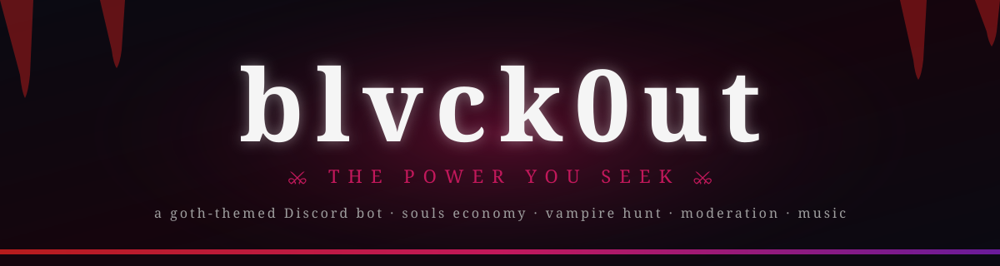

<div align="center">



# blvck0ut

**A goth-themed Discord bot that lurks in the shadows.**

*Souls economy · vampire hunting · moderation · music · leveling · TTS — all wrapped in animated, blood-stained embeds.*

[](https://discord.js.org/)
[](https://nodejs.org/)
[](https://github.com/WiseLibs/better-sqlite3)
[](./LICENSE)
[]()

</div>

---

> ⚔ *the power you seek*

`blvck0ut` is a Discord bot I built to run a goth/vampire-themed community server. It rolls a soul-based economy, a creature-collecting hunt system, full mod tooling, music, leveling, TTS and welcome embeds into one self-hosted package — every reply is a rich, animated embed that fits the aesthetic.

---

## Highlights

- **100+ slash commands** across nine feature areas, all loaded by a tiny auto-discovering handler.
- **Souls economy** with daily/work/crime, three gambling games, a configurable shop, soul drops in chat, profanity fines, and a 15-tier role ladder topping out at 50,000,000 souls.
- **Hunt & collect system** — a built-in mini-RPG with a bestiary, lootboxes, sacrifices, teams, battles and rarity-weighted drops.
- **Music with Opus passthrough** — `discord-player` + `yt-dlp` stream YouTube Opus directly, skipping the FFmpeg re-encode for higher quality and lower CPU.
- **Custom leveling cards** rendered with `@napi-rs/canvas`, plus configurable level-roles and a level-import command for migrating from MEE6/Tatsu/etc.
- **Welcome system** with a generated banner image, autoroles, goodbye messages and a reaction-role color panel.
- **Animated theme engine** that resolves animated server emojis at runtime by *name*, so re-uploads don't break the embeds.
- **Self-hostable** on a Raspberry Pi or anywhere Node 18+ runs — there's a `deploy-to-pi.sh` for pushing to a home server.

## Tech stack

`Node.js 18+` · `discord.js v14` · `discord-player v7` + `discord-player-youtubei` · `@discordjs/voice` · `better-sqlite3` · `@napi-rs/canvas` · `ffmpeg-static` + `yt-dlp` · `google-tts-api` · `dotenv`

---

<!--
## Screenshots

> Drop your demo media into `.github/screenshots/` and the previews below will fill in automatically.

| Hunt | Economy / Shop | Leveling card |
| :--: | :------------: | :-----------: |
|  |  |  |

| Welcome banner | Music queue | Tarot reading |
| :------------: | :---------: | :-----------: |
|  |  |  |

---
-->


## Commands at a glance

<details open>
<summary><b>Souls economy (20)</b></summary>

| Command | What it does |
| --- | --- |
| `/balance` | Wallet, bank and net worth in souls |
| `/daily` | Claim 250 souls every 24h |
| `/work` · `/crime` | Earn souls (with a chance of failure on `/crime`) |
| `/coinflip` · `/dice` · `/slots` | Three gambling games with embed animations |
| `/give` | Transfer souls to another user (15% tax) |
| `/shop` · `/buy` · `/inventory` | Browse the shop and purchase roles/items |
| `/leaderboard` | Top 10 richest souls in the server |
| `/cooldowns` | See every active cooldown at a glance |
| `/pick` | Grab the random soul drops that spawn in chat |
| `/multiplier` | Configurable XP/soul multipliers |
| `/economy …` (admin) | Give, take, reset balances and edit the shop |

</details>

<details>
<summary><b>Hunting / mini-RPG (10)</b></summary>

| Command | What it does |
| --- | --- |
| `/hunt` | Multi-encounter rolls with rarity-weighted drops |
| `/bestiary` · `/zoo` | Browse every monster you've encountered or own |
| `/team` · `/battle` | Build a team and PvE battle |
| `/inv` · `/sell` · `/sacrifice` | Manage and convert your collection |
| `/lootbox` · `/crypt` | Open lootboxes and explore the crypt |

</details>

<details>
<summary><b>Moderation (21)</b></summary>

| Command | What it does |
| --- | --- |
| `/ban` · `/kick` · `/mute` · `/unban` | Standard mod actions with audit-channel logs |
| `/warn` · `/unwarn` · `/warnings` | Persistent warning system |
| `/purge` · `/purgebots` | Bulk delete with filters |
| `/automod` | Word filter, anti-invite, profanity fines |
| `/promote` · `/demote` · `/massrole` · `/supporter` | Role tooling |
| `/steal` · `/stealgif` · `/stealsticker` · `/removesticker` | Emoji & sticker management |
| `/report` · `/rules` · `/send` | Reports, server rules, embed sender |

</details>

<details>
<summary><b>Fun (28)</b></summary>

| Command | What it does |
| --- | --- |
| `/8ball` · `/tarot` · `/poll` · `/quote` | Classic chat games + a goth-themed tarot reader |
| `/afk` · `/reminder` · `/snipe` | AFK status, reminders, deleted-message sniping |
| `/serverstats` · `/img` · `/search` · `/tr` | Server stats, image search, web search, translate |
| `/uwulock` · `/uwuunlock` | Force-uwu-ify a chosen user (consenting servers only) |
| `/boostcolor` | Custom role colors for boosters |
| Reaction commands | `/hug` `/kiss` `/cuddle` `/pat` `/slap` `/bite` `/lick` `/punch` `/stab` `/kill` `/fang` `/fly` `/slurp` `/fuck` |

</details>

<details>
<summary><b>Leveling (6)</b></summary>

| Command | What it does |
| --- | --- |
| `/rank` | Custom canvas-rendered rank card |
| `/levels` | Server XP leaderboard |
| `/setlevelrole` · `/removelevelrole` · `/levelroles` | Configure level-up role rewards |
| `/importlevels` | Import existing levels from MEE6/Tatsu CSV |

</details>

<details>
<summary><b>Music (8)</b></summary>

| Command | What it does |
| --- | --- |
| `/play` · `/pause` · `/resume` · `/skip` · `/stop` | Standard playback controls |
| `/queue` · `/nowplaying` · `/volume` | Queue inspection and volume |

YouTube audio streams Opus directly via `yt-dlp -f bestaudio[acodec=opus]`, falling back to the FFmpeg path only if Opus isn't available — fewer re-encodes, less CPU on the Pi.

</details>

<details>
<summary><b>Welcome, TTS & giveaways (10)</b></summary>

| Command | What it does |
| --- | --- |
| `/setwelcome` · `/setgoodbye` · `/setautorole` | Configure join/leave embeds + autoroles |
| `/colorpanel` · `/profilepanel` | Reaction-role panels for colors and profiles |
| `/tts` · `/say` · `/voice` · `/ttstop` | Voice-channel TTS with selectable voices |
| `/giveaway` | Run timed giveaways with reaction entries |

</details>

---

## Project layout

```text
src/
├── commands/        # Slash commands, grouped by feature area
│   ├── economy/     #   balance · daily · work · crime · shop · …
│   ├── fun/         #   tarot · poll · 8ball · reaction commands · …
│   ├── giveaway/    #   giveaway
│   ├── hunting/     #   hunt · bestiary · battle · zoo · …
│   ├── leveling/    #   rank · levels · levelroles · …
│   ├── moderation/  #   ban · mute · warn · automod · …
│   ├── music/       #   play · queue · skip · …
│   ├── tts/         #   tts · say · voice
│   └── welcome/     #   setwelcome · colorpanel · …
├── events/          # Discord gateway event handlers
├── handlers/        # Auto-loaders for commands & events
├── data/            # Static data (monsters, tarot deck, quotes)
└── utils/           # economy.js · hunting.js · leveling.js · theme.js · …
data/                # SQLite db files (gitignored)
assets/              # Fonts, welcome banner, etc.
deploy-commands.js   # Registers slash commands with Discord
index.js             # Bot entrypoint
```

---

## Getting started

### Prerequisites

- **Node.js 18+** (tested on 20)
- **`yt-dlp`** on the system `PATH` for music streaming — `brew install yt-dlp` / `pip install yt-dlp` / `winget install yt-dlp`
- A **Discord application & bot token** — create one at <https://discord.com/developers/applications>

### Install

```bash
git clone https://github.com/Armaan-Khehra/blvck0ut.git
cd blvck0ut
npm install
```

### Configure

```bash
cp .env.example .env
```

Then fill `.env`:

```env
DISCORD_TOKEN=your-bot-token
CLIENT_ID=your-application-id
GUILD_ID=your-test-server-id
WELCOME_PING_ROLE_ID=optional-role-id
WELCOME_PING_CHANNEL_ID=optional-channel-id
```

### Register slash commands

```bash
npm run deploy
```

### Run

```bash
npm start          # production
npm run dev        # nodemon hot-reload
```

The bot logs `Music extractors loaded` once `discord-player` finishes registering YouTube/SoundCloud/etc., then signs in.

### Deploy to a Raspberry Pi (optional)

```bash
./deploy-to-pi.sh
```

The included script rsyncs the project, installs deps, registers commands and restarts the bot under your user systemd service.

---

## Required bot permissions & intents

Privileged intents to enable in the Developer Portal:

- `SERVER MEMBERS INTENT`
- `MESSAGE CONTENT INTENT`
- `PRESENCE INTENT`

Recommended permissions when inviting:

`Manage Roles` · `Manage Channels` · `Kick Members` · `Ban Members` · `Manage Messages` · `Read Message History` · `Connect` · `Speak` · `Use Voice Activity` · `Add Reactions` · `Use External Emojis` · `Embed Links` · `Attach Files` · `Use Slash Commands`

---

## Configuration notes

- The economy DB auto-creates with **5,000 starting souls** per user.
- Animated emojis are resolved by **name** at runtime in `src/utils/theme.js`, so you can re-upload them without breaking embeds — just keep the names consistent.
- The welcome banner template lives at `assets/welcome-banner.png` and is composed at runtime with `@napi-rs/canvas`.
- All persistent state lives in `data/blvck0ut.sqlite` and `data/bot.db`. Both are gitignored.

---

## Roadmap

- [ ] Per-guild config UI (web dashboard)
- [ ] Voice activity → souls multiplier
- [ ] Cross-guild leaderboards
- [ ] Quest system on top of `/hunt`

---

## Contributing

This started as a personal project for one community, but PRs that fit the goth aesthetic are welcome. See [CONTRIBUTING.md](./CONTRIBUTING.md).

## License

[MIT](./LICENSE) — do whatever you want, just don't claim you wrote it.

---

<div align="center">
<sub>Built by <b>Ari</b> — a 19-year-old CS student who would rather be writing Discord bots.</sub>
</div>
